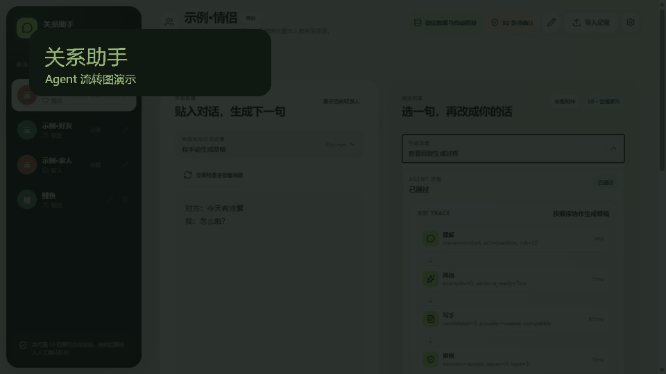
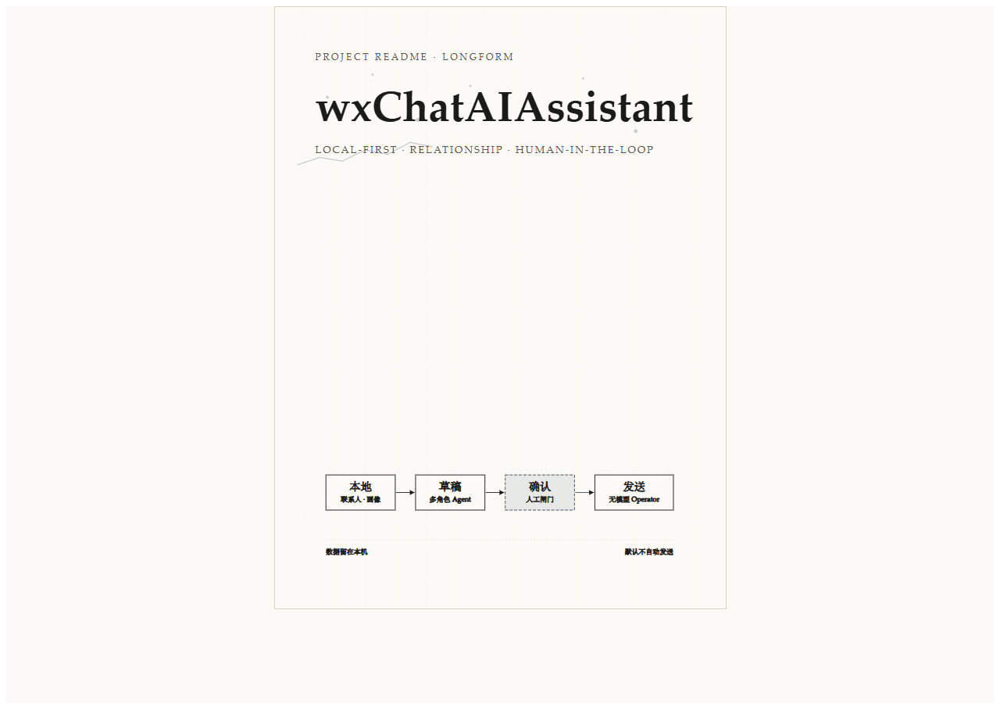
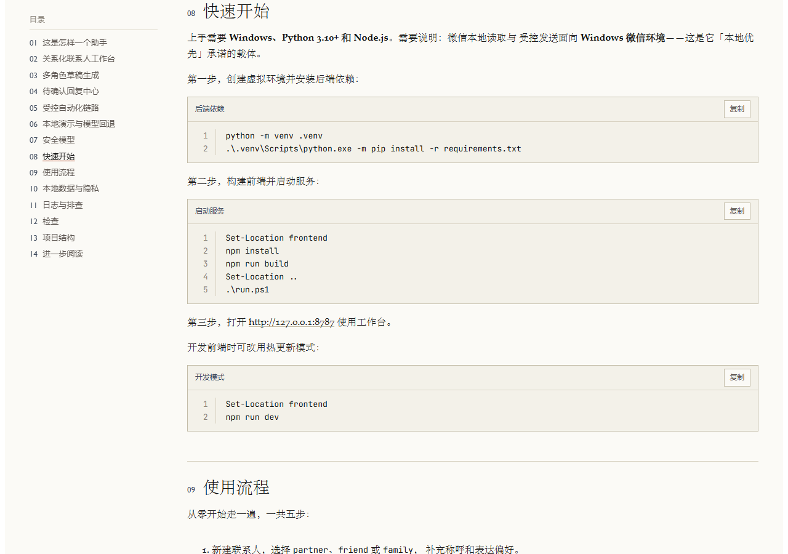
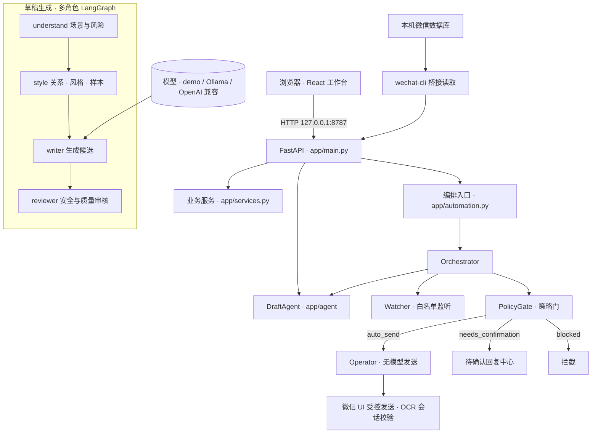

# wxChatAIAssistant

本地优先的关系型微信 AI 聊天助手。它按**联系人关系、表达习惯与对话上下文**生成回复草稿；微信读取、表达画像、设置与运行记录默认都保留在你自己电脑上。


> [!IMPORTANT]
> **默认不发送任何消息。** 自动回复默认关闭、默认 dry-run、默认仅 L0、默认空白名单；L1/L2 必须人工逐条确认，L3 直接拦截。真实发送只由**无模型的 Operator** 执行，且必须持有用户已批准的原文。



## 📖 精美长文版（beautiful-article 重制）

本 README 已由 [beautiful-article](https://github.com/ConardLi/garden-skills/tree/main/skills/beautiful-article) 重制为**单文件 HTML 长文**：tufte 版式、封面 + 目录、共 14 章，可离线阅读。

- **在线阅读（渲染版）**：[打开精美长文](https://htmlpreview.github.io/?https://raw.githubusercontent.com/Barry04/wxChatAIAssistant/master/articles/wxchat-readme-article/article/article.html)
- **仓库内文件**：[`article.html`](articles/wxchat-readme-article/article/article.html)（下载后用浏览器打开）

<p align="center">
  
  
</p>

## ✨ 功能亮点

| 亮点 | 说明 |
| --- | --- |
| 🧑‍🤝‍🧑 关系化联系人工作台 | 为情侣、朋友、家人维护不同的称呼、边界、回复长度、表情与幽默偏好；可在左侧直接编辑关系类型或删除自己添加的联系人。 |
| 🤖 多角色草稿生成 | LangGraph 图按 `understand → style → writer → reviewer` 协作：识别场景与风险、组合关系与个人风格、生成候选，并进行安全与质量审核。 |
| 🧾 待确认回复中心 | 默认按当前会话过滤，可切换查看全部会话；逐条查看上下文、修改候选，确认后才把批准文本交给发送执行器。 |
| 🔁 受控自动化链路 | Watcher 读取白名单消息，Orchestrator 按 `watch → memory → draft → policy → operator/queue` 编排；Operator 只接收已批准的原文，负责会话校验、发送与结果验证。 |
| 🎭 本地演示与模型回退 | 演示模式可离线体验；支持 Ollama 与 OpenAI 兼容接口，外部调用失败时自动回退到本地模板。 |
| 🔒 本地优先 | 个人数据默认留在项目本地；模型调用日志不保存 API Key、提示词、聊天正文或模型回复。 |

## 🏗 架构与数据流

单仓库架构：Python 后端读取本机微信数据库、蒸馏个人表达、监听白名单新消息；React 工作台负责配置、分析与 dry-run 事件查看。



要点：

- **手工生成**（`POST /api/generate`）只走 DraftAgent；草稿角色**不具备微信发送能力**。
- **自动回复**由 Orchestrator 编排 `watch → memory → draft → policy → operator/queue`；它调度角色，不是 LLM Supervisor。
- **PolicyGate** 在代码中判定 `auto_send / needs_confirmation / blocked`；demo、写手 fallback、dry-run、未确认真实发送、L3 与低置信度一律不得 `auto_send`。
- **Operator** 无模型：入参必须是 `{talker, approved_text}`，步骤为绑定会话 → 发送 → 时间线校验；没有已批准原文不得运行。
- 自动化事件带 `agent` 字段（`watch / draft / policy / operator`），可全程追踪。

## 🔒 安全模型

| 风险级别 | 行为 |
| --- | --- |
| L0 | 可生成普通草稿；只有白名单、明确开启、关闭 dry-run 且通过策略门时才可能自动发送。 |
| L1 / L2 | 进入待确认队列，必须由用户逐条确认或放弃。 |
| L3 | 拦截，不生成可直接发送的候选。 |

边界约定：

- 草稿 Agent 不具备微信发送能力；真实发送只由无模型的 Operator 执行，且必须已有批准的原文。
- 默认不发送、默认 dry-run、默认仅 L0、默认空白名单；持续记忆同步默认开启但仍受白名单约束。
- 微信数据库通过本地 `wechat-cli` 读取，不使用 OCR；Windows 微信 4.x 真实发送前的会话校验使用系统内置 OCR。
- 未经用户明确批准，不执行真实发送测试。
- **请勿将本工具用于未经对方同意的自动化沟通。**

## 🚀 快速开始

需要 **Windows**、**Python 3.10+** 与 **Node.js**。微信本地读取与受控发送面向 Windows 微信环境。

1. 创建虚拟环境并安装后端依赖：

   ```powershell
   python -m venv .venv
   .\.venv\Scripts\python.exe -m pip install -r requirements.txt
   ```

2. 构建前端并启动服务：

   ```powershell
   Set-Location frontend
   npm install
   npm run build
   Set-Location ..
   .\run.ps1
   ```

3. 打开 [http://127.0.0.1:8787](http://127.0.0.1:8787)。

> `run.ps1` 使用 `.venv\Scripts\python.exe` 启动 `uvicorn app.main:app`；若虚拟环境不存在会直接报错，请先完成第 1 步。

前端独立开发时可改用 `npm run dev`（Vite 默认端口 5173，后端 CORS 已放行）。

## 📱 使用流程

1. 新建联系人，选择 `partner`、`friend` 或 `family`，补充称呼与表达偏好。
2. 导入自己的聊天记录，或在演示模式下粘贴一段虚构对话。
3. 在“手动生成”中产出候选，选择或编辑最终草稿。
4. 如需监听微信消息，先只启用 dry-run，并从“待确认”工作台逐条审核。
5. 只有在你明确接受风险并完成相关配置后，才考虑启用真实发送。

## 🔍 日志与排查

实时查看模型调用与自动回复动作：

```powershell
Get-Content .\data\model-calls.jsonl -Tail 20 -Wait
Get-Content .\data\automation-events.jsonl -Tail 20 -Wait
```

服务运行后，也可通过 HTTP 查看：

```text
GET http://127.0.0.1:8787/api/logs/model-calls?limit=50
GET http://127.0.0.1:8787/api/automation/events?limit=50
```

模型调用日志**不会保存** API Key、提示词、聊天正文或模型回复。Windows 微信 4.x 真实发送会使用系统 OCR 校验右侧顶部会话标题；目标不一致时中止，临时图像在识别后立即删除。

## 🧪 检查与测试

```powershell
.\.venv\Scripts\python.exe -m pytest -q
.\.venv\Scripts\python.exe -m compileall -q app
Set-Location frontend
npm run lint
npm run build
```

## 🛡 数据与隐私

个人数据默认位于项目 `data/` 目录：

- `data/config.sqlite3`：联系人、模型与自动回复设置（SQLite 事务写入）。
- `data/messages.jsonl`、`data/feedback.jsonl`：导入记录、演示样本与草稿反馈（逐行追加）。
- `data/profile.json`、`data/self-skill/`：全局、关系与联系人级表达画像（原子替换写入）。
- `data/automation-state.json`、`data/automation-events.jsonl`：自动化状态与动作记录。

> API Key 与其他运行设置一起保存在本地 SQLite。**公开仓库不应包含** `data/`、`private/`、`.runtime/`、日志、环境变量或私钥；提交前请再次检查暂存区是否含个人数据。

## 🗂 项目结构

```text
app/agent/              LangGraph 多角色草稿生成（understand → style → writer → reviewer）
app/runtime/            Watcher、PolicyGate 与自动化编排
app/operator/           无模型受控微信发送与发送后验证
app/main.py             FastAPI 路由与静态文件托管
frontend/               React 19 + Vite 工作台
skills/relationships/   运行时关系类型沟通配置（YAML）
config/safety.yaml      风险等级展示配置
tools/                  辅助脚本（如 Windows 微信 OCR 会话标题校验）
data/                   本地个人数据（不会上传）
tests/                  自动化测试
docs/                   架构、命令与设计文档
articles/               beautiful-article 长文成品与过程记录
```

## 📚 文档与许可

- [📖 精美长文版（HTML 渲染）](articles/wxchat-readme-article/article/article.html)
- [架构说明](docs/harness/architecture.md)
- [常用命令](docs/harness/commands.md)
- [关系型微信助手设计](docs/relationship-wechat-assistant-design.md)
- [LangGraph 多角色设计](docs/superpowers/specs/2026-08-09-langgraph-multi-agent-design.md)

本项目基于 **Apache License 2.0** 开源，详见 [LICENSE](LICENSE)。