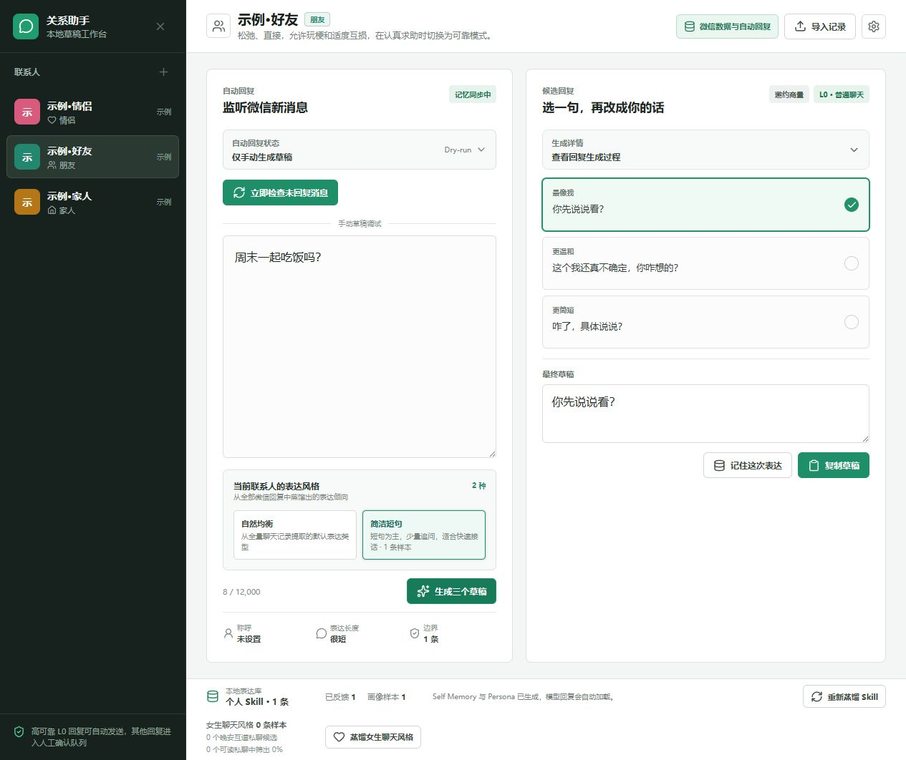

# wxChatAIAssistant

一个在自己电脑上运行的关系型微信 AI 聊天助手。

它读取本机微信聊天数据，结合联系人关系、沟通风格和对话上下文，帮助你理解消息、生成并优化回复，以及在安全边界内处理自动回复。默认不会替你发送消息。

## 实际界面

下图使用项目内置的“示例·好友”和一段虚构对话生成，展示了关系选择、候选回复、最终编辑和 dry-run 状态；不包含任何真实联系人或聊天记录。



## 它适合做什么

- 给伴侣、朋友或家人分别设置不同的沟通方式。
- 导入自己的聊天记录，提炼常用的回复长度、语气和表情习惯。
- 根据当前连续对话中的一条或多条消息理解上下文，生成多条候选回复，并支持编辑为最终回复。
- 用“演示模式”离线体验，不调用外部大模型。
- 可选地监听白名单联系人；自动发送默认关闭，并默认只做 dry-run（只生成记录、不发消息）。

## 开始前

需要 Windows、Python 3.10+ 和 Node.js。微信本地读取和受控发送功能面向 Windows 微信上运行的本地数据。

## 三步启动

1. 创建并安装 Python 环境：

   ```powershell
   python -m venv .venv
   .\.venv\Scripts\python.exe -m pip install -r requirements.txt
   ```

2. 启动后端：

   ```powershell
   .\run.ps1
   ```

   打开 http://127.0.0.1:8787 。

3. （可选）启动前端开发服务器：

   ```powershell
   Set-Location frontend
   npm install
   npm run dev
   ```

   若要让后端直接托管前端页面，改为执行 `npm run build`。

## 使用方式

1. 在工作台中新建联系人，选择关系类型：`partner`、`friend` 或 `family`。
2. 导入自己的聊天记录，或在演示模式下直接输入对话。
3. 为收到的消息生成候选回复，选择或编辑后再发送。
4. 如需使用监听功能，先只启用 dry-run，确认行为符合预期后再考虑开启真实发送。

## 隐私与安全

本项目以本地优先为原则。聊天记录、联系人、表达画像、自动化事件、本机微信配置、截图、日志和 API Key 都只应保存在你的电脑上。

公开仓库不会包含这些内容：`data/`、`private/`、`.runtime/`、`.claude/`、日志文件、环境变量文件和私钥文件均已加入 `.gitignore`。提交前仍建议运行 `git status --ignored` 和敏感信息扫描，确认没有个人数据进入暂存区。

自动回复默认关闭；L1/L2 风险内容需要确认，L3 内容会被拦截。请勿把工具用于未经对方同意的自动化沟通。

## 测试与检查

```powershell
.\.venv\Scripts\python.exe -m pytest -q
.\.venv\Scripts\python.exe -m compileall -q app
Set-Location frontend
npm run lint
npm run build
```

## 项目结构

```text
app/                    FastAPI 后端、回复生成和自动化逻辑
frontend/               React + Vite 工作台
config/                 风险分级配置
skills/relationships/   关系类型的沟通配置
tests/                  自动化测试
tools/                  本地导入工具
docs/                   架构、命令和设计文档
data/                   本地个人数据（不会上传）
private/                本机私密配置（不会上传）
```

## 进一步阅读

- [架构说明](docs/harness/architecture.md)
- [常用命令](docs/harness/commands.md)
- [开发约定](docs/harness/conventions.md)
