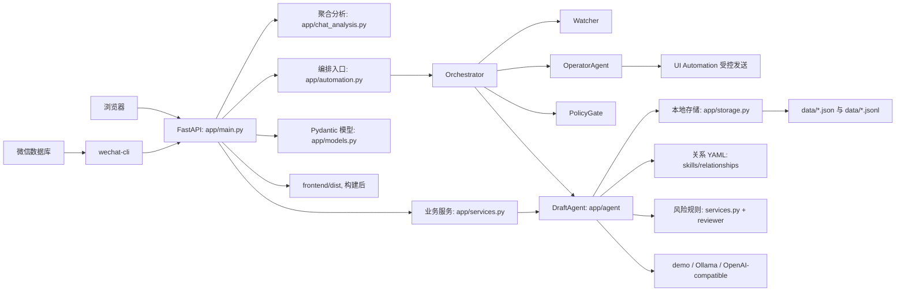

# 架构

## 概览

本项目是单仓库、本地优先的微信自动回复助手。Python 后端读取本机微信数据库、蒸馏个人表达、监听白名单新消息；React 工作台负责配置、分析和 dry-run 事件查看。

## 模块职责

| 路径 | 职责 | 状态 |
|---|---|---|
| `app/main.py` | FastAPI 路由、联系人 CRUD、导入、生成、反馈、设置和静态文件托管 | [已验证] |
| `app/models.py` | 请求、联系人和运行设置的 Pydantic 校验模型 | [已验证] |
| `app/services.py` | 导入解析、场景与风险识别、检索、画像提炼、反馈落库；`generate_reply` 委托 Agent 图 | [已验证] |
| `app/agent/` | LangGraph 多角色草稿生成：understand → style → writer → reviewer，含 trace；零微信发送依赖 | [已验证] |
| `app/runtime/policy.py` | 发送策略门：dry-run、demo、回退、L3、低置信度等，只输出 auto_send / needs_confirmation / blocked | [已验证] |
| `app/runtime/watcher.py` | 时间线读取、游标基线、群触发、未回复检测；不生成、不发送 | [已验证] |
| `app/runtime/orchestrator.py` | 按 watch → memory → draft → policy → operator/queue 调度；不是 LLM Supervisor | [已验证] |
| `app/operator/` | 无模型发送执行器：绑定会话、粘贴发送、时间线校验；无已批准原文不得运行 | [已验证] |
| `app/self_skill.py` | 全局 Self Memory/Persona 与联系人级表达画像蒸馏 | [已验证] |
| `app/storage.py` | 根路径、默认演示数据、JSON/JSONL 读写和关系 YAML 加载 | [已验证] |
| `app/wechat_cli_bridge.py` | 微信数据库状态、会话和时间线读取，转换结构化问答记录 | [已验证] |
| `app/chat_analysis.py` | 回复速度、时段、长度、消息类型和关系维度聚合 | [已验证] |
| `app/automation.py` | Worker 线程、锁、confirm/discard、暂停与游标；循环委托 Orchestrator | [已验证] |
| `skills/relationships/*.yaml` | 情侣、朋友、家人关系的运行时沟通原则与模式 | [已验证] |
| `config/safety.yaml` | 风险等级展示配置 | [已验证] |
| `frontend/` | React + Vite 工作台，提供联系人、导入、草稿、反馈与设置界面 | [已验证] |

## 请求与数据流

### 草稿生成

1. `POST /api/generate` 根据 `contact_id` 加载联系人，并调用 `generate_reply()`。
2. `app/agent` 的 LangGraph 图按 `understand → style → writer → reviewer` 协作生成。
3. `understand` 识别场景、对话动作/主题与 L0-L3 风险；L3 短路，不进入写手。
4. `style` 加载关系 YAML、Self Skill/Persona，并按“同联系人 > 同关系 > 同场景”检索历史样本。
5. `writer` 在 `demo` 下用本地模板；否则调用 Ollama / OpenAI 兼容接口；失败回退模板。
6. `reviewer` 做安全与质量审核，可 `accept` / `revise`（最多重写 1 次）/ `block`。
7. 响应保留原有字段，并新增 `agent_mode`、`trace`、`review`、`style_brief`。

### 自动回复编排

1. 手工 `POST /api/generate` 只走 DraftAgent（`app/agent`），角色不得发送微信。
2. 自动轮询由 Orchestrator 执行 `watch → memory → draft → policy → operator|queue`。
3. PolicyGate 在代码中判定 `auto_send` / `needs_confirmation` / `blocked`；demo、写手 fallback、dry-run、未确认真实发送、L3 与低置信度不得 `auto_send`。
4. OperatorAgent 无模型：入参必须是 `{talker, approved_text}`，步骤为绑定会话 → 发送 → 时间线校验。
5. `POST /api/automation/confirm/{id}` 只把用户确认后的原文交给 Operator；主工作区待确认队列调用同一 API。
6. 自动化事件带 `agent` 字段：`watch` / `draft` / `policy` / `operator`。

  1. `memory_sync_enabled` 独立控制持续记忆同步，默认开启；`enabled` 只控制自动回复。
  2. 自动化轮询每次读取白名单联系人的时间线。
  3. 通过 `timeline_to_records()` 只提取已完成的“对方消息 → 本人回复”回合。
  4. 使用 `source_record_id` 去重写入 `data/messages.jsonl`。
  5. 发现新增样本后自动重新生成全局、关系和联系人级画像；dry-run 候选不会写入训练语料。

### 本地数据

| 文件 | 内容 | 写入方式 |
|---|---|---|
| `data/config.sqlite3` | 联系人、模型运行设置和自动回复设置 | SQLite 事务写入 |
| `data/messages.jsonl` | 导入、反馈和演示聊天样本 | 逐行追加 |
| `data/feedback.jsonl` | 用户选中和最终编辑的草稿 | 逐行追加 |
| `data/profile.json` | 轻量表达画像 | 原子替换 JSON 文件 |
| `data/self-skill/meta.json` | 全局画像、关系画像和联系人画像索引 | 原子替换 JSON 文件 |
| `data/self-skill/contacts/*.md` | 单个联系人表达画像，按 `contact_id` 哈希命名 | 原子替换文本文件 |
API Key 与其他运行设置一起保存在本地 SQLite。

## 关键边界

  - 自动回复默认关闭、默认 dry-run、默认仅 L0、默认空白名单；持续记忆同步默认开启但仍受白名单约束。
- 微信数据库通过本地 `wechat-cli` 读取，不使用 OCR。
- L1/L2 必须等待确认，L3 禁止发送。
- 未经用户明确批准，不执行真实发送测试。
- 数据默认保留在项目本地 `data/` 目录。
- 运行时关系 YAML 与 Harness Agent Skill 使用同一顶层 `skills/` 目录，但前者是应用配置，后者必须使用 `SKILL.md` 文件区分。
- 前端构建产物仅在 `frontend/dist/assets` 存在时由 FastAPI 托管；否则根路由返回前端尚未构建的提示。

## 已知缺口

- [已验证] `frontend/src/App.jsx` 已接入联系人、导入、生成、反馈、提炼和运行设置 API。
- [已验证] 风险等级标签、动作和关键词统一从 `config/safety.yaml` 加载；代码仅保留 L0-L3 的处理优先级。
- [已验证] 联系人中的回复长度、表情和幽默偏好会写入 `style_brief` 与写手提示词；离线 demo 模板也会按偏好缩短、去笑点或补语气。
- [已验证] 草稿生成已切换为 LangGraph 多角色图，并识别最后一句的对话动作和主题；主工作区展示待确认队列，顶栏条数作为入口。
- [已验证] 发送只经 Operator；`app/agent/` 不依赖微信发送。
- [已验证] 用户反馈写入聊天样本后会立即重新蒸馏 Self Skill，后续草稿可使用最新表达。
- [已验证] 设计说明见 `docs/superpowers/specs/2026-08-09-langgraph-multi-agent-design.md`。
