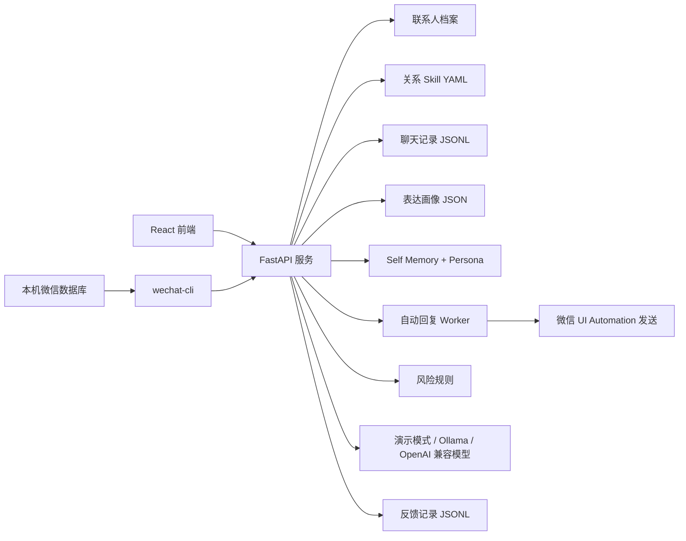

# 关系型微信聊天助手设计说明

## 1. 定位

本项目是一个本地优先的微信自动回复助手。它直接读取本机微信聊天数据库，根据联系人关系、历史表达习惯和最新上下文生成回复，并按风险等级执行 dry-run、等待确认、阻止或受控发送。

V1 的核心原则：

- 使用本地 `wechat-cli` 读取微信数据库，不使用 OCR，不要求用户复制聊天内容。
- 自动回复默认关闭且默认 dry-run。
- 仅处理白名单联系人，默认只有 L0 普通聊天允许自动发送。
- L1/L2 只生成待确认草稿，L3 禁止代答。
- 导入的数据仅保存在本机 `data/` 目录。
- 模型 API Key 仅保存在当前后端进程内，重启后需要重新填写。
- 涉及金钱、账号、医疗、法律等高风险内容时，不提供可直接发送的代答。

## 2. 系统目标

1. 用联系人档案表达不同关系中的沟通偏好。
2. 导入既有聊天记录，提炼用户的轻量表达画像。
3. 根据关系类型加载差异化的沟通 Skill。
4. 监听白名单联系人的新消息，识别场景、检索相似历史回复并生成候选。
5. 按 L0-L3 风险等级决定 dry-run、自动发送、等待确认或阻止。
6. 从本人真实回复中蒸馏 Self Memory 与 Persona。

## 3. 架构概览

后端入口为 `app/main.py`。生产式访问由 FastAPI 提供 API，并在前端构建产物存在时托管 `frontend/dist`。

## 4. 核心对象

### 联系人

联系人由 `Contact` 模型定义，包含：

- `contact_id`：稳定唯一标识。
- `display_name`：展示名称。
- `wechat_username`：绑定的微信会话 ID。
- `relationship`：`partner`、`friend` 或 `family`。
- `preferred_address`：可在回复中使用的确认过的称呼。
- `message_length`、`emoji_level`、`humor_level`：沟通偏好。
- `boundaries`：不能由助手替用户作出的承诺或表述。
- `is_demo`：是否为演示联系人。

联系人、模型运行设置和自动回复设置统一存储在 `data/config.sqlite3`。

### 聊天样本

每条聊天样本使用 JSONL 逐行追加，核心字段包括联系人、关系类型、场景、对方消息、本人回复和来源。来源可以是导入记录、用户反馈或内置演示数据。

聊天样本存储在 `data/messages.jsonl`，用户选定并编辑后的结果还会记录到 `data/feedback.jsonl`。

### 关系 Skill

关系 Skill 存放在 `skills/relationships/`：

- `partner.yaml`：情侣沟通，优先回应情绪，不擅自作出关系承诺。
- `friend.yaml`：好友沟通，可使用口语和适度玩笑，但认真求助时切换为可靠回应。
- `family.yaml`：家人沟通，温和明确，不编造位置、饮食、健康和行程。

Skill 负责定义关系原则、可用场景和前端展示色，不替代风险控制。

## 5. 主流程

### 5.1 导入与风格提炼

1. 系统通过 `wechat-cli` 获取本机微信会话和结构化消息。
2. 系统按“连续对方消息 + 连续本人回复”形成问答样本并去重写入 JSONL。
3. 样本保留消息时间、类型、会话类型和首次回复耗时等结构化字段。
4. 蒸馏统计回复长度、回复速度、1/5 分钟内回复比例、活跃时段、深夜占比、问句、笑声/emoji 和消息类型。
5. 结果写入 `data/profile.json` 与 `data/self-skill/{self.md,persona.md,meta.json}`。
6. TXT、Markdown 和 CSV 手工导入继续作为兼容与调试入口。

这是一种轻量统计画像，不是模型微调，也不会尝试推断用户未提供的身份、情感或敏感属性。

### 5.2 生成回复草稿

1. 后台 Worker 轮询白名单联系人的最新结构化消息。
2. 首次运行只建立消息游标基线，避免回复历史消息。
3. 出现对方新消息时，系统使用关键词识别场景，例如安慰、冲突、邀约、玩笑和关心。
4. 系统先执行风险分级，再加载联系人、关系 Skill、Persona 与相似历史记录。
5. dry-run 或自动回复关闭时只记录草稿；实际发送仅在联系人位于白名单且风险等级属于允许列表时发生。
6. L1/L2 进入待确认事件，L3 直接阻止。
7. 手工工作台仍可生成三个候选、编辑并提交反馈。

## 6. 相似回复检索

当前版本使用无需额外服务的字符二元组检索：

- 对当前对话和历史对方消息分别生成二元组集合。
- 以 Jaccard 重叠度作为基础相似度。
- 同一联系人、同一关系、同一场景和反馈来源会获得额外加分。
- 返回最多四条分数大于阈值的历史样本。

该方案适合 V1 的小规模本地数据集，优点是可解释、离线可运行且无向量数据库依赖。数据规模或语义检索质量成为瓶颈时，可在保持相同检索接口的前提下替换为本地嵌入模型与向量索引。

## 7. 风险控制

风险规则位于 `config/safety.yaml`，运行时由 `app/services.py` 中的关键字规则执行。

| 等级 | 含义 | 当前行为 |
| --- | --- | --- |
| L0 | 普通聊天 | 允许生成；仅在白名单、启用且非 dry-run 时自动发送 |
| L1 | 需要核实事实 | 生成待确认草稿，不自动发送 |
| L2 | 敏感关系场景 | 生成待确认草稿，不自动发送 |
| L3 | 高风险信息 | 阻止生成可发送回复 |

L3 覆盖转账、借款、验证码、密码、银行卡、医疗、法律与合同等关键词。L1 和 L2 的候选文本仍不得编造事实、位置、行程、金钱决定或重大承诺。

风险分级是辅助保护，不等同于完整的内容审核系统。模型模式下仍需保留提示词约束、接口侧规则和用户最终确认这三层防线。

## 8. 模型接入

运行设置支持三种提供方：

- `demo`：默认离线模式，使用关系模板和历史示例，不发送外部请求。
- `ollama`：调用本地 Ollama 的 `/api/chat` 接口。
- `openai-compatible`：调用兼容 Chat Completions 的服务接口。

模型输出必须是包含三条候选的 JSON。若网络连接、模型响应或 JSON 解析失败，系统自动回退到离线候选，并返回故障提示。

API Key 与其他模型运行设置统一存储在本地 `data/config.sqlite3`；应用重启后需要重新配置。

## 9. API 边界

现有后端 API 按用途划分如下：

| 功能 | 接口 |
| --- | --- |
| 健康检查 | `GET /api/health` |
| 联系人管理 | `GET/POST /api/contacts`、`DELETE /api/contacts/{contact_id}` |
| 关系 Skill | `GET /api/skills` |
| 数据统计与风格提炼 | `GET /api/stats`、`POST /api/distill` |
| 文本与文件导入 | `POST /api/import/text`、`POST /api/import/file` |
| 微信状态与会话 | `GET /api/wechat/status`、`GET /api/wechat/sessions` |
| 微信历史读取 | `POST /api/wechat/import-recent`、`POST /api/wechat/import-contact/{contact_id}` |
| 聚合分析 | `GET /api/wechat/analysis` |
| Self Skill | `GET /api/self-skill`、`POST /api/self-skill/distill` |
| 自动回复 | `GET/PUT /api/automation/settings`、`GET /api/automation/status`、`POST /api/automation/run-once` |
| 草稿生成 | `POST /api/generate` |
| 反馈学习 | `POST /api/feedback` |
| 运行设置 | `GET/PUT /api/settings` |

`POST /api/generate` 的响应包含场景、风险等级、Skill、相似样本、候选草稿、警告和当前提供方，便于前端展示生成依据与用户决策点。

## 10. 已知状态与下一步

后端已具备微信数据库读取、结构化导入、聚合分析、Self Skill 蒸馏、风险控制、白名单 Worker、dry-run 和受控 UI Automation 发送。React 工作台已接入微信连接、最近历史读取、Persona 蒸馏、联系人会话绑定、自动回复设置和事件状态。

后续建议按以下顺序推进：

1. 为待确认事件增加明确的“批准发送/拒绝”队列。
2. 为本地数据提供导出、清空和删除确认，并明确数据保留策略。
3. 将风险关键词、场景规则和 Skill 配置统一为可审阅的配置层。
4. 在用户明确批准的测试联系人和文本上验证一次真实发送链路。
