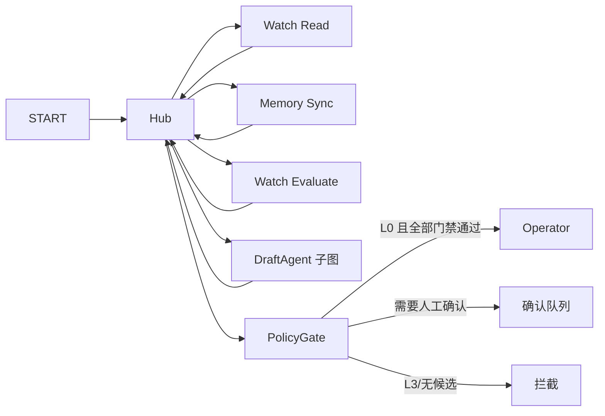

# LangGraph 多角色与自动回复 Hub 设计

## 目标

项目包含两个相互独立的图层：手工草稿的四角色子图，以及自动回复的 Hub 编排图。Hub 只负责受限任务调度，不拥有微信发送权限。

## 草稿子图

```mermaid
flowchart LR
    START --> understand
    understand -->|L3| END1[拦截]
    understand -->|L0-L2| style
    style --> writer
    writer --> reviewer
    reviewer -->|accept/block| END2[结束]
    reviewer -->|revise，最多一次| writer
```

`app/agent/graph.py` 继续负责 `understand → style → writer → reviewer`。L3 在理解节点后短路；审核最多要求一次重写。角色和工具不得调用微信发送。

## 自动回复 Hub 图



`app/runtime/hub_graph.py` 使用 `StateGraph`。每个 Task 完成后返回 Hub；Hub 输出受控的 `next_task`、`reason_code` 和 `decision_source`。路由目标先经过代码生成的允许集合校验，模型异常时回退规则路由。

### Hub 状态与上下文

- State 只保存联系人业务字段、时间线处理状态、游标相关结果和受控 Trace。
- Host、Worker、运行时 API Key 等对象通过 `context_schema` 传入，不进入 State、事件或 Trace。
- 自动回复链路不启用 LangSmith 追踪；模型调用元数据仍不保存提示词、聊天正文或凭据。
- Hub 不允许选择联系人、修改候选正文、调用 Operator 或改变 Policy 结果。

### 安全策略

- 默认值保持 `enabled=false`、`dry_run=true`、空白白名单和 `auto_send_levels=["L0"]`。
- 只有 L0 可在已启用、关闭 dry-run、确认真实发送、非 demo、非 fallback 且通过 Policy 的情况下进入 Operator。
- L1/L2 只进入确认队列；L3 返回空候选并拦截。
- Operator 只能发送已批准原文，并在时间线中回读校验；校验失败保留游标以便重试。

## 事件与前端

自动化事件保留既有 `agent`、`action`、`generation` 等字段，并增加：

- `orchestration_mode: "langgraph-hub"`
- `hub_reason`
- `hub_trace[]`：`task`、`status`、`next_task`、`reason_code`、`decision_source`、`duration_ms`

前端以 Task 卡片 → Hub 卡片的形式展示实时流转；Policy、确认队列和 Operator 单独作为硬门禁分支。旧事件没有 `hub_trace` 时继续按原线性方式显示。
