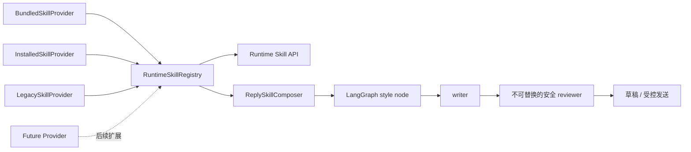

# 可插拔运行时 Skill 重构设计

日期：2026-08-14
状态：用户已审核确认，可进入实施

## 1. 背景与问题

`wxChatAssistant` 当前同时承担两类职责：

1. 读取微信消息、理解上下文、生成回复并执行安全审查。
2. 从聊天记录蒸馏 Self Skill、联系人画像和固定的“女生聊天风格”。

这使运行时与 Skill 生产逻辑耦合：

- `app/storage.py#load_skill` 固定从 `skills/relationships/<relationship>.yaml` 读取三种关系配置。
- `app/self_skill.py` 同时负责样本筛选、蒸馏、文件生成、预设列表和提示词渲染。
- `app/agent/roles/style.py` 直接判断 `style:` 前缀并调用 `get_style_prompt()`。
- `frontend/src/App.jsx` 直接展示和触发“女生聊天风格”蒸馏。

目标架构将职责拆开：本项目只做微信自动回复运行时及 Skill 消费；未来独立项目负责读取素材、蒸馏、验证和打包 Skill。

参考 DeepSeek Harness 的设计，本项目采用“注册表 + Provider + Consumer + 按需加载”的能力缝隙，但不引入 Cordis，也不把整个应用改造成微内核。DeepSeek Harness 当前处于 Developer Preview，可能发生破坏性变更，因此只借鉴其稳定抽象，不建立运行时依赖。

参考资料：

- <https://github.com/deepseek-ai/deepseek-harness>
- <https://github.com/deepseek-ai/deepseek-harness/blob/master/docs/architecture.md>
- <https://github.com/deepseek-ai/deepseek-harness/blob/master/docs/subsystems/skills.zh.md>
- <https://github.com/deepseek-ai/deepseek-harness/blob/master/docs/cookbook/extension-cookbook.md>

## 2. 目标

### 2.1 本次重构目标

- 建立独立于蒸馏算法的 Runtime Skill 契约。
- 用统一 Registry 管理内置、已安装和旧数据兼容 Skill。
- 回复生成只通过 Registry 和 Composer 获取 Skill，不再直接读取蒸馏文件或判断固定 Skill ID。
- 支持标准目录形式的独立 Skill 包，由其他项目或人工生成后接入。
- 保持现有联系人、风格预设、回复生成、自动化和安全行为兼容。
- 保持本地优先；Skill 默认不能读取原始聊天记录、执行代码或发送微信。
- 为未来远程 Provider、ZIP 安装器和独立蒸馏项目保留稳定接口。

### 2.2 非目标

- 本阶段不创建独立蒸馏项目。
- 本阶段不删除 `app/self_skill.py`、现有蒸馏接口或用户已有数据。
- 本阶段不支持 Skill 内任意 Python、Node.js、Shell 或动态库代码。
- 本阶段不实现公网 Skill 市场、GitHub 安装、自动更新、签名服务或依赖解析。
- 本阶段不把微信读取、LangGraph、模型适配器、风险规则、发送链路或整个前端插件化。
- 本阶段不允许 Skill 覆盖 L0-L3、安全审查、白名单、dry-run 和真实发送确认。

## 3. 项目职责地图

| Project ID | 状态 | 主要职责 | 数据所有权 | 契约 |
|---|---|---|---|---|
| `wxchatassistant` | `[已验证]` | 微信读取、回复生成、Skill 加载与组合、安全审查、受控发送 | 联系人配置、自动化状态、已安装 Skill 副本、运行日志 | Runtime Skill Package v1 |
| `skill-distiller` | `[未知]` | 未来负责素材导入、样本筛选、蒸馏、评估和 Skill 打包 | 蒸馏项目自己的素材与中间产物 | 输出 Runtime Skill Package v1 |

`skill-distiller` 尚无路径或代码，本设计不假设其语言、框架或部署方式。它只需要输出符合契约的目录包，不直接访问本项目 SQLite、自动化状态或发送链路。

第一阶段只有 `wxchatassistant` 发生代码修改，因此不触发多仓库同名分支门禁。未来两个项目同时开发时，必须先确认相同分支名或记录明确的分支映射。

## 4. 总体架构



设计只抽象 Skill 能力缝隙：

- Provider 负责发现和读取一种来源的 Skill。
- Registry 负责校验、合并、优先级、快照和按 ID 加载。
- Composer 负责根据联系人和本次请求选择 Skill，并生成结构化提示上下文。
- Agent 只消费 Composer 结果，不了解 Skill 来源和蒸馏方式。
- Reviewer 与自动发送保护属于核心安全层，永远不由 Skill 提供。

## 5. Runtime Skill Package v1

### 5.1 目录结构

```text
<skill-id>/
├── SKILL.md                  # 可独立安装的通用 Agent Skill 正文
├── manifest.json             # wxChatAssistant 运行时接入元数据
├── references/               # 可选；按正文显式引用
└── assets/                   # 可选；第一阶段不注入模型
```

`SKILL.md` 是独立交付内容；`manifest.json` 是本应用的运行时 sidecar。其他 Agent 工具可以忽略 `manifest.json`，本应用也不会把未知的 `SKILL.md` frontmatter 直接当成运行时权限。

### 5.2 `SKILL.md` 最小约定

```markdown
---
name: concise-daily-chat
description: 在日常微信对话中使用简短、自然的表达方式。
---

# 简洁日常聊天

仅描述可迁移的表达规则，不包含具体联系人的身份、称呼、经历、地址、金额、承诺或聊天正文。
```

`name` 必须与 `manifest.json.id` 相同，采用 kebab-case：

```text
^[a-z0-9]+(?:-[a-z0-9]+)*$
```

### 5.3 `manifest.json` 契约

```json
{
  "schema_version": 1,
  "id": "concise-daily-chat",
  "name": "简洁日常聊天",
  "version": "1.0.0",
  "description": "在日常微信对话中使用简短、自然的表达方式。",
  "kind": "reply-style",
  "entrypoint": "SKILL.md",
  "activation": "explicit",
  "selectors": {
    "relationships": [],
    "scenes": ["daily"]
  },
  "permissions": ["prompt:contribute"]
}
```

字段规则：

| 字段 | 规则 |
|---|---|
| `schema_version` | 第一版固定为 `1`；未知主版本拒绝加载 |
| `id` | kebab-case；一个注册表快照内唯一 |
| `name` | 用户可见名称，1–80 字符 |
| `version` | 语义化版本 `MAJOR.MINOR.PATCH` |
| `description` | 目录摘要，1–300 字符，不包含聊天正文 |
| `kind` | 第一版支持 `relationship-guidance`、`reply-style`、`persona-context` |
| `entrypoint` | 第一版固定为包内 `SKILL.md`，不得逃逸包目录 |
| `activation` | `automatic` 或 `explicit` |
| `selectors.relationships` | 可选的 `partner`、`friend`、`family` 列表；空表示不限制 |
| `selectors.scenes` | 可选场景列表；空表示不限制 |
| `permissions` | 第一版只能是 `prompt:contribute` |

第一版不在 manifest 中声明代码入口、网络、数据库、微信发送、文件写入或工具调用权限。

## 6. 核心领域接口

具体实现可使用 Python `Protocol`、Pydantic 模型或 dataclass，但语义固定如下。

### 6.1 摘要与完整定义

```python
class RuntimeSkillSummary:
    id: str
    name: str
    version: str
    description: str
    kind: str
    activation: str
    source: str
    provider: str


class RuntimeSkillDefinition(RuntimeSkillSummary):
    content: str
    selectors: dict[str, list[str]]
    permissions: list[str]
    resource_base: str
```

列表接口只返回 Summary，不返回正文和本机绝对路径。只有选中 Skill 后才读取完整 Definition。

### 6.2 Provider

```python
class RuntimeSkillProvider(Protocol):
    name: str
    rank: int

    def list(self) -> list[RuntimeSkillCandidate]: ...
    def get(self, candidate: RuntimeSkillCandidate) -> RuntimeSkillDefinition | None: ...
```

Provider 只负责自己的来源。远程初始化、身份验证或未来网络读取必须封装在新 Provider 中，不能写入 Registry 或回复生成节点。

### 6.3 Registry

```python
class RuntimeSkillRegistry:
    def register_provider(self, provider: RuntimeSkillProvider) -> Callable[[], None]: ...
    def snapshot(self) -> RuntimeSkillCatalogSnapshot: ...
    def list(self) -> list[RuntimeSkillSummary]: ...
    def get(self, skill_id: str) -> RuntimeSkillDefinition | None: ...
    def invalidate(self, provider_name: str | None = None) -> None: ...
```

注册返回 disposer；调用 disposer 后 Provider 不再出现在新快照中。第一阶段不实现文件 watcher，以下动作触发显式失效：

- 应用启动完成 Provider 装配。
- Runtime Skill reload API 被调用。
- 后续安装、更新或卸载动作完成。
- Legacy 蒸馏结果发生变化。

完整 Definition 不长期缓存；每次选用时重新校验入口文件，防止目录摘要与正文漂移。

### 6.4 重名和优先级

Provider 优先级从高到低：

1. `installed`：100
2. `legacy`：200
3. `bundled`：300

同一 Provider 内重复 ID 使相关候选无效并返回诊断。不同 Provider 出现同 ID 时，rank 较小者获胜，其他候选保留为 `shadowed` 诊断；不得依赖文件遍历顺序静默决定。

核心安全规则不属于 Registry，因此不存在通过同名 Skill 覆盖安全层的路径。

## 7. Provider 设计

### 7.1 BundledSkillProvider

代码随项目交付的运行时 Skill 放在：

```text
runtime-skills/bundled/<skill-id>/
```

第一阶段将现有关系 YAML 的可迁移沟通原则转换为三个内置包：

- `relationship-partner`
- `relationship-friend`
- `relationship-family`

原 `skills/relationships/*.yaml` 在兼容期保留，直到新 Provider 与所有消费者验证完成后再单独清理。

新目录名刻意避开以下现有语义：

- `skills/*/SKILL.md`：Harness 生成的开发知识。
- `skill/*/SKILL.md`：项目专用 Agent Skill。
- `skills/relationships/*.yaml`：旧运行时关系配置。

### 7.2 InstalledSkillProvider

用户已安装包放在：

```text
data/runtime-skills/installed/<skill-id>/
```

第一阶段支持人工复制，或由外部项目先在 `.staging-<uuid>` 临时目录写完并校验，再原子改名为 `<skill-id>` 后显式 reload。Installed Provider 忽略所有以 `.` 开头的目录，避免读取半成品。ZIP 上传、Git URL 安装和市场发现属于后续安装器阶段。

Provider 只读取符合 v1 契约的直属目录，不递归扫描任意深度，也不执行包内脚本。

### 7.3 LegacySkillProvider

兼容 Provider 将现有产物映射为只读 Skill：

- `data/self-skill/persona.md` → `legacy-self-persona`
- 当前聚合风格 → 保留 `style:concise`、`style:balanced`、`style:expressive`、`style:questioning`、`style:playful` 的 API 别名
- `data/self-skill/girls-chat-style.md` → `legacy-girls-chat-style`，并保留 `style:girls-chat` 别名

Legacy Provider 不再负责蒸馏，只读取现有输出并转换为统一定义。`distill_self_skill()` 或旧蒸馏接口成功写入后调用 Registry invalidate。

## 8. Skill 选择与回复组合

### 8.1 选择规则

每次生成回复最多选择：

- 一个 `relationship-guidance` Skill，由联系人关系自动确定。
- 一个 `persona-context` Skill，兼容期默认使用 `legacy-self-persona`。
- 一个 `reply-style` Skill，按以下顺序确定：
  1. 本次生成请求显式指定。
  2. 联系人保存的 `style_preset_id`。
  3. 兼容别名 `style:balanced`。
  4. 没有可用项时不加载可选风格。

显式选择的 Skill 若不存在、不可用或不满足 selector，API 返回可解释的 400 错误，不静默替换成另一个同名或相似 Skill。只有未指定可选 Skill 时才允许正常回退。

### 8.2 Composer 输出

`ReplySkillComposer` 返回结构化结果：

```json
{
  "selected": [
    {"id": "relationship-friend", "kind": "relationship-guidance", "source": "bundled"},
    {"id": "concise-daily-chat", "kind": "reply-style", "source": "installed"}
  ],
  "prompt_sections": [
    {"kind": "relationship-guidance", "skill_id": "relationship-friend", "content": "..."},
    {"kind": "reply-style", "skill_id": "concise-daily-chat", "content": "..."}
  ],
  "warnings": []
}
```

`style_node` 只调用 Composer，不读取 `app.self_skill`，也不根据 `style:` 前缀决定行为。

### 8.3 提示词优先级

最终回复上下文按以下优先级解释：

1. 核心安全规则与 L0-L3 决策。
2. 当前对话事实、对话动作和 `response_plan`。
3. 联系人明确边界与用户设置。
4. 关系 Skill。
5. Persona Skill。
6. 用户选择的表达风格 Skill。
7. 已脱敏、同联系人的历史示例。

低优先级内容不能覆盖高优先级内容。Skill 内容与来源 ID 一并写入 trace 元数据，但日志不得记录 Skill 正文、聊天正文或模型完整提示词。

## 9. API 与前端边界

### 9.1 新 API

```text
GET  /api/runtime-skills
GET  /api/runtime-skills/{skill_id}
POST /api/runtime-skills/reload
```

- 列表接口返回 Summary、启用状态和安全诊断，不返回绝对路径或正文。
- 单项接口只用于本地管理界面预览，返回正文前必须确认 Skill 来自已注册 Provider；不暴露聊天数据。
- reload 只重新发现和校验目录，不安装依赖、不执行代码、不触发蒸馏。

### 9.2 兼容 API

第一阶段继续保留：

- `GET /api/skills`
- `GET /api/style-presets`
- `GET/POST /api/self-skill/*`
- 联系人和生成请求中的 `style_preset_id`

这些接口的读取端逐步改为 Registry/Legacy Provider，响应字段保持兼容。删除旧接口必须等独立蒸馏项目可用，并作为单独的破坏性版本处理。

### 9.3 前端

第一阶段将固定“女生聊天风格”展示改为通用 Runtime Skill 目录：

- 展示名称、类型、版本、来源、状态和说明。
- 联系人配置可选择 `reply-style` Skill。
- 无效或被遮蔽的包展示诊断，不进入选择列表。
- 保留旧蒸馏按钮和状态，但标记为兼容功能；本阶段不新增通用蒸馏界面。
- 不提供任意代码授权、网络授权或真实发送授权入口。

## 10. 安全与隐私

- Skill 只有 `prompt:contribute` 权限，不能直接调用微信、模型、文件写入、网络或系统命令。
- Provider 不接收原始聊天记录；Composer 只把已选 Skill 的声明式正文加入回复上下文。
- `SKILL.md` 最大 256 KiB，`manifest.json` 最大 64 KiB；超限包拒绝加载。
- `entrypoint` 和资源路径解析后必须位于包目录内。
- 指向包目录外的符号链接拒绝加载。
- Installed Provider 忽略 `.staging-*` 和其他点号目录；外部生产方必须完成写入和校验后再原子发布。
- 非 UTF-8、非法 JSON、未知 schema 主版本、未知权限、缺少入口或名称不一致均形成包级诊断。
- 单个坏包不能阻止其他合法包和微信自动回复启动。
- Skill 内容视为用户提供的低信任指令，不能覆盖核心安全规则、联系人边界和实时事实。
- 自动回复默认值继续保持 `enabled=false`、`dry_run=true`、空白名单和仅 L0。
- 安装、reload 或选择 Skill 不得自动开启真实发送。

## 11. 错误处理与可观测性

Registry 快照包含：

```json
{
  "skills": [],
  "complete": true,
  "revision": "sha256:...",
  "diagnostics": []
}
```

- `complete=false` 表示至少一个 Provider 暂时失败；Consumer 保留上一份完整快照用于未显式指定的自动选择。
- 显式选择 Skill 时必须重新 `get()`；若正文已消失或失效，拒绝本次生成并返回说明。
- `revision` 由规范化摘要计算，只用于变更判断，不作为持久事实源。
- 日志记录 provider、skill_id、version、选择来源、加载耗时和错误码，不记录正文或本机绝对目录。
- Legacy Provider 失败时，仍允许无 Persona/无可选风格的安全模板回退；关系 Skill 缺失时返回配置错误，不猜测另一种关系。

## 12. 迁移波次

### Wave 1：建立契约和 Registry

- 新增 Runtime Skill 模型、manifest 校验、Registry 和诊断结构。
- 新增 Bundled、Installed、Legacy 三个 Provider。
- 将三个关系配置打包为 bundled Skill，同时保留旧 YAML。
- 增加 Registry 单元测试，不改变现有回复消费者。

### Wave 2：切换 Consumer

- 新增 `ReplySkillComposer`。
- 将 `style_node` 改为只消费 Composer。
- 用 Registry 实现新 API，并让旧 `/api/style-presets` 通过兼容映射读取。
- 保持现有请求和联系人数据可用。

### Wave 3：通用前端目录

- 新增 Runtime Skill 列表、诊断和选择界面。
- 将固定的“女生聊天风格”卡片降级为 Legacy Skill 展示。
- 保留旧蒸馏操作，不在本项目增加新的蒸馏任务设计器。

### Wave 4：独立蒸馏项目接入（未来需求）

- 新项目输出 Runtime Skill Package v1。
- 通过受控复制、未来 ZIP 安装器或独立 Provider 接入。
- 完成跨项目契约测试后，再规划移除本项目蒸馏代码。

### Cleanup：删除旧蒸馏职责（未来破坏性变更）

- 删除固定蒸馏 UI 和旧接口。
- 删除已无消费者的 `app/self_skill.py` 生产逻辑。
- 数据迁移和删除另行征得用户确认；本次重构不删除任何历史数据。

## 13. 验证策略

### 13.1 模块级

- manifest 合法/非法字段、路径逃逸、大小限制和名称一致性测试。
- Provider 列表、按需读取、失效、重名优先级和坏包隔离测试。
- Registry 完整/不完整快照以及 disposer 测试。
- Composer 选择优先级、selector、不存在和无可选 Skill 回退测试。

### 13.2 项目级

```powershell
.\.venv\Scripts\python.exe -m compileall -q app
.\.venv\Scripts\python.exe -m pytest -q
Set-Location frontend
npm run lint
npm run build
```

### 13.3 契约级

- 用独立 fixture 目录构造 Runtime Skill Package v1，不导入本项目 Python 模块。
- 确认该包可被 Installed Provider 发现、列出、选择和加载。
- 确认标准 `SKILL.md` 在忽略 `manifest.json` 时仍是可读的独立 Skill。
- 旧 `style:*` ID、`/api/style-presets` 和联系人存量数据继续工作。

### 13.4 链路级

- 无 Skill：仍能生成安全草稿。
- 内置关系 Skill：partner/friend/family 分别加载正确。
- 已安装 style Skill：显式选择后只影响表达层。
- 坏包：目录显示诊断，其他 Skill 和自动回复不受影响。
- L1/L2：即使 Skill 要求自动回复，仍进入待确认。
- L3：任何 Skill 下都必须阻止生成可直接发送候选。
- reload：不改变自动回复启用状态、dry-run、白名单或游标。

## 14. 验收条件

- AC1：回复生成代码不再直接导入或调用蒸馏实现获取 Skill。
- AC2：新增一个符合 v1 契约的本地目录包后，reload 可以发现并用于指定联系人回复。
- AC3：Skill 列表默认只传输摘要，正文仅在预览或使用时加载。
- AC4：现有三种关系、Self Persona、五种聚合风格和女生聊天风格通过兼容层继续可用。
- AC5：旧联系人 `style_preset_id` 和旧 API 调用无需立即迁移。
- AC6：非法包、重名包和 Provider 失败有可观察诊断，但不阻止其他合法 Skill。
- AC7：任何 Skill 都不能绕过 L0-L3、联系人边界、dry-run、白名单和真实发送确认。
- AC8：第一阶段没有执行第三方代码、自动网络安装或删除用户数据。
- AC9：后续蒸馏项目无需导入本项目源码，只按 Runtime Skill Package v1 输出目录即可接入。

## 15. 已确认决策与后续决策

已确认：

- 当前项目收敛为微信自动回复运行时。
- 蒸馏职责未来迁往独立项目。
- 第一阶段采用 Skill Registry/Provider/Consumer 架构。
- Skill 可以是应用内条目，也可以是包含 `SKILL.md` 的独立安装包。
- 第一阶段只允许声明式 Skill，不运行第三方任意代码。

后续独立规格再决定：

- 独立蒸馏项目的技术栈和仓库路径。
- ZIP/Git/市场安装协议、签名、锁文件和自动更新。
- 远程 Provider 的认证、离线缓存与撤销策略。
- 旧蒸馏数据的最终迁移和清理时间。
